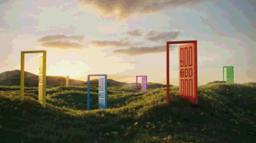

# steganography_script
Steganography script to implement the LSB method to hide one image in another image

## Algorithm

The project is composed of two scripts:

### Main Script

1º The least significant bytes the container is eliminated, for each pixel

2º The most significant bytes of the secret image is obtaied, for each pixel

3º The most significant bytes of our secret image is placed as the lest significant bytes of each pixel the container image.

### Reversed Script

1º The least significant bytes of the image is obtained.

2º A new Image is created, for each pixel the significant byte will be the least significant bytes of each pixel (the secret image pixel)

3º The least significant bytes of each pixel will be 0.

## How to activate the python3 enviroment

```bash
python3 -m venv venv
source venv/bin/activate
pip install -r requirements.txt
```

## How to execute it:

This script requieres two arguments:

-secret: corresponds to the relative path of the secret image

-container: corresponds to the relative path of the container image

```bash
   python3 script.py --secret img/Secret.png --container img/Container.png 
```

The reverse script requires one argument:

-image: corresponds to the relative path of the image that contains the secret image

```bash
   python3 reverse_script.py --image img/out.png 
```

## Example:

### Container


### Secret


### Image hiding the secret


### Secret recovered
